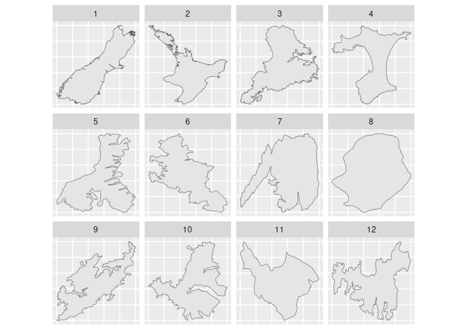

<!-- README.md is generated from README.Rmd. Please edit that file -->

# freegeomsf

<!-- badges: start -->
<!-- badges: end -->

The goal of freegeomsf is to modify sf data in order to simulate the
support for free scales in facted ggplots (as if we did
`+ facet_wrap(~a, scales = "free"))`).

Currently we only support a single option, to rescale every geom to its
own unit square. Other variants are possible (x vs y, grouped scales,
etc).

## Installation

You can install the development version of freegeomsf like so:

``` r
# install.packages("pak")
pak::pak("mdsumner/freegeomsf")
```

## Example

This is a basic example which shows how to plot some polygons of a New
Zealand data set separately as facets.

``` r
library(freegeomsf)

library(ggplot2)
ggplot(freegeomsf(sfx[1:12, ])) + geom_sf() + facet_wrap(~a) + 
   theme(axis.title.x=element_blank(),
        axis.text.x=element_blank(),
        axis.ticks.x=element_blank(), 
        
        axis.title.y=element_blank(),
        axis.text.y=element_blank(),
        axis.ticks.y=element_blank())
```



This would be a completely pointless plot if we faceted with the
original data because we can’t control the scales in the usual ways.

(Sometimes we want to see what polygons look like relative to other
polygons, other options IYI involve cowplot or patchwork but this
approach was sufficient here).

A less verbose way to remove axis labels wbg.

Note that the axes are unrealistic here because we can only *simulate*
free scales by modifying the data. This kind of plot is essential for
some work, but it would be nice to keep the reality of the axes too but
we can’t.

(We could of course decompose the data and use geom_polygon, but there’s
a lot of details to worry about and this was easier just to get on with
the work required).

## Motivation

This was motivated by the need for a simple plot requirement so we could
see the relationship between polygons in detail. Sometimes you can’t
tell what polygons are holes in what other polygons, and this is
obviously a useful thing to be able to indicate in environmental
protection and management scenarios.

The idea was originally noted here:
<https://gist.github.com/mdsumner/7b354f73b47ccb67861ff0363cdbb3d3>

## Code of Conduct

Please note that the freegeomsf project is released with a [Contributor
Code of
Conduct](https://contributor-covenant.org/version/2/1/CODE_OF_CONDUCT.html).
By contributing to this project, you agree to abide by its terms.
